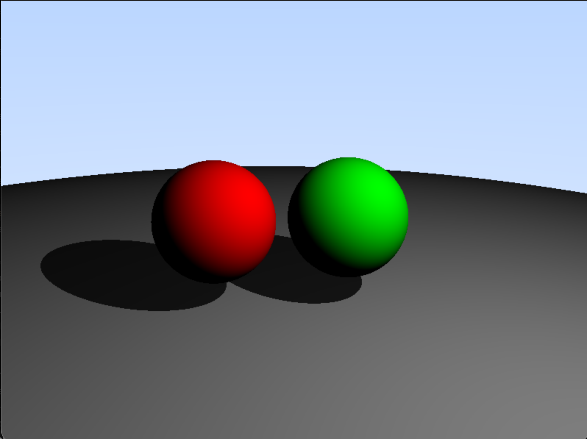

# Overview
Simplistic implementation of ray tracing on the CPU. Works by computing the given lighting on objects which is then passed as a texture into the OpenGL pipeline allowing the render to be displayed.

Compute Shader that ray traces on objects at 60 FPS.

## Future Plans
(OLD) Plan to move to Metal to use a compute shader for calculating ray tracing. 
Note: Currently due to optimization runs at 3 FPS on modern computer.

To add reflectivity and bouncing to the rays.